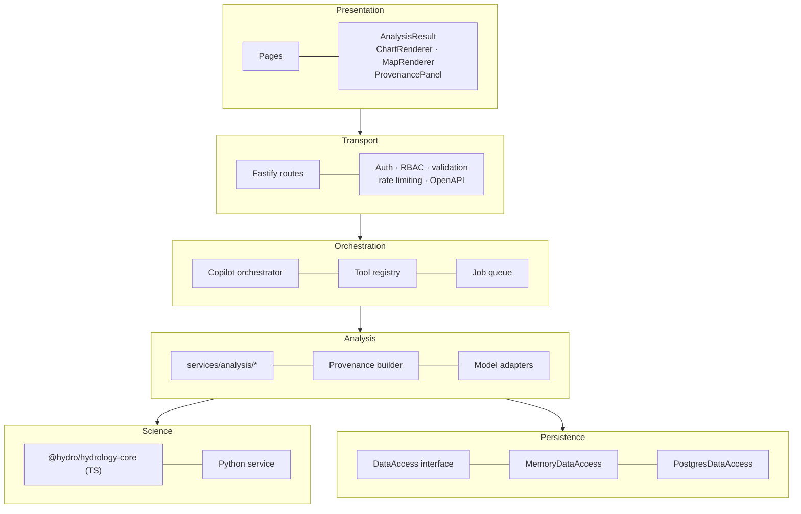
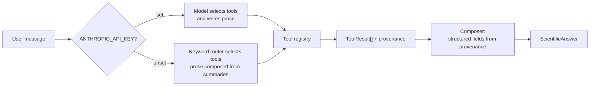
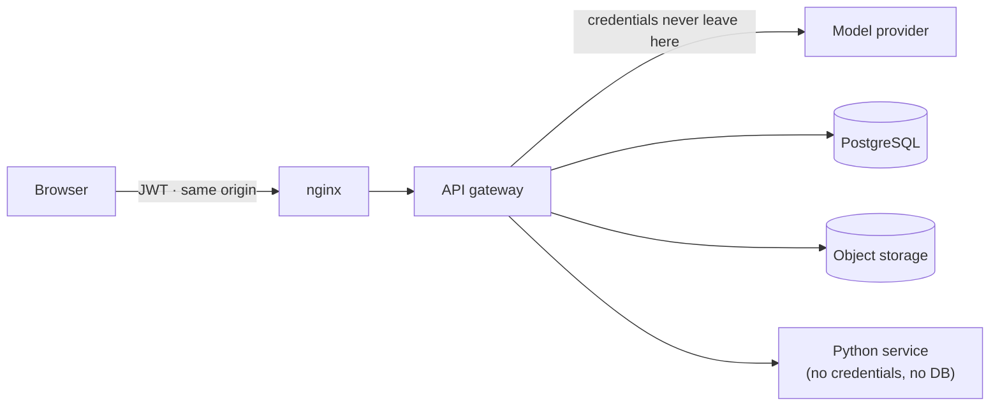

# Architecture

How the platform is put together, and why each boundary is where it is.

---

## The governing constraint

A scientific decision-support system fails in a specific way: it produces a number that looks like a
measurement but is not, and nobody can tell which is which afterwards. Every architectural decision
here is chosen to make that failure mode impossible rather than merely unlikely.

The mechanism is a single shape returned by every analytical code path:

```typescript
interface ToolResult {
  ok: boolean;
  summary: string;                      // prose, traceable to the values below
  data: Record<string, unknown>;        // tool-specific payload
  charts: ChartSpec[];                  // each carries its own caption
  maps: MapSpec[];
  metrics: Record<string, number | null>;
  quantities: Record<string, Quantity>; // { value, unit } — never a bare number
  warnings: string[];
  provenance: ProvenanceRecord;         // not optional
}
```

`provenance` is not optional and has no default. A new analysis cannot compile without building one.

---

## Layers



Each layer depends only on the one below it. The two consequences that matter:

- **The Copilot cannot reach data.** It selects a tool name and arguments; the registry is the only
  thing that executes. Every Copilot answer therefore has the same provenance as the equivalent REST
  call, because it *is* the same code.
- **The analysis layer does not know about HTTP.** The same function backs `/api/drought`, the
  `assess_drought` Copilot tool and the drought section of a generated report. A figure cannot differ
  between a dashboard and a report, because there is one code path.

---

## Persistence: two implementations, one interface

`DataAccess` (`apps/api/src/store/types.ts`) is implemented twice:

| | `MemoryDataAccess` | `PostgresDataAccess` |
| --- | --- | --- |
| Availability | Always | When `DATABASE_URL` is set and reachable |
| Demonstration data | Generated at boot | Loaded by `npm run db:seed` |
| Durability | None — and `/api/status` says `not_configured` | Full |
| Spatial queries | In-process geometry | PostGIS |

Startup tries PostgreSQL when configured; on failure it falls back to memory **and reports the
failure** in `/api/status` with the connection error. It never silently degrades.

This is why `npm install && npm run dev` produces a working scientific application: the demonstration
store is a first-class backend, not a mock.

---

## The Copilot

```
apps/api/src/copilot/
├── tools.ts          Tool catalogue — the single source of truth
├── registry.ts       name → executor
├── router.ts         Deterministic keyword routing + argument extraction
├── anthropic.ts      Messages API client + system prompt
├── orchestrator.ts   The pipeline both engines run through
└── composer.ts       Structured answer assembly from provenance
```

`tools.ts` drives three consumers: the tool schema sent to the language model, the keyword router,
and the tool documentation in the UI. A tool added in one place appears in all three.

### Two engines, one pipeline



The engine affects only *which* tools run and *who writes the prose*. The structured fields — data
used, period, spatial extent, methods, assumptions, results, uncertainty, recommendations — are
assembled mechanically from provenance records in `composer.ts`. The model cannot contribute to them,
so it cannot invent a data source or a method that was not used.

When the model call fails mid-conversation, the orchestrator falls back to the router, completes the
analysis, and adds a warning explaining the substitution.

### The router

Keyword scoring over the same catalogue, with explicit argument extraction: forecast horizons
("next 14 days" → `horizonDays: 14`), index timescales ("SPI-12" → `timescaleMonths: 12`), return
periods, discharges with units, model names, scenarios, sectors, report kinds and date ranges.

It selects the top tool plus any within 55 % of its score, capped at three, so a compound question
runs both analyses without the plan sprawling. When nothing matches it returns `unsupported`, and the
Copilot says it cannot answer rather than guessing.

---

## Scientific computation split

| | `@hydro/hydrology-core` | Python service |
| --- | --- | --- |
| Language | TypeScript, zero dependencies | Python 3.12 |
| Contains | SPI, SPEI, SSI, LP3, GEV, flow statistics, baseflow, GR4J, CCME WQI, Mann–Kendall, reservoir simulation, water balance, model metrics, baseline forecasting | Random Forest, XGBoost, LightGBM, LSTM/GRU, permutation importance, NetCDF/GeoTIFF/Parquet/Excel profiling |
| Availability | Always | When `SCIENCE_SERVICE_URL` is set |
| Determinism | Bit-for-bit | Seeded; quantiles agree to floating-point rounding |

The metric suite is implemented in both and tested against the same reference values, so a divergence
is a test failure rather than a silent inconsistency between what the gateway reports and what the ML
service reports.

When a machine-learning model is requested and the service is unreachable, the API runs the
autoregressive baseline **and states in the response that the metrics belong to the baseline, not to
the requested model**. Silent substitution would be the worst possible failure here: the user would
attribute the baseline's skill to XGBoost.

---

## Model adapters

```typescript
interface HydrologicModelAdapter {
  available(): Promise<boolean>;
  requirements(): AdapterRequirement[];
  capabilities(): string[];
  validateInput(req: ModelRunRequest): Promise<ValidationResult>;
  runModel(req: ModelRunRequest): Promise<ModelRunResult>;
  retrieveOutput(runId: string): Promise<ModelOutput | null>;
  calculateMetrics(runId: string): Promise<ModelMetrics | null>;
}
```

`ExternalEngineAdapter` implements the contract for HEC-HMS, HEC-RAS, SWAT, SWAT+ and MODFLOW. Each
declares its executable environment variable, its required inputs and its capability list, validates
a run request without executing anything, and returns `status: 'integration_required'` when the
engine is absent — with no output, no metrics and no charts.

GR4J is the exception: implemented in TypeScript, always available, fully tested. It is what makes the
modelling workflow — run, calibrate, validate, evaluate — demonstrable end to end on a clean install.

---

## Jobs

`JobQueue` gives long-running work the lifecycle `queued → running → completed | failed | cancelled`,
progress reporting and WebSocket notifications, all backed by a database record.

Jobs **execute in-process** with bounded concurrency, and `/api/status` says so — including when
`REDIS_URL` is set. A queue that reported "redis" while running in one process would mislead an
operator about durability and about whether a second replica does anything.

The BullMQ integration point is two methods: `enqueue()` (replace the internal array with a BullMQ
`Queue`) and `run()` (replace with a `Worker` consuming it). Everything else — the database record,
the progress callback, the WebSocket events, the handler contract — is already backend-agnostic.

A *running* job is not interrupted by cancellation: stopping a scientific computation part-way leaves
partial state, so only queued jobs can be cancelled and the API says so.

---

## Frontend

```
apps/web/src/
├── layouts/AppShell.tsx     Sidebar (17 sections) + top bar
├── pages/                   One per section
├── components/
│   ├── AnalysisResult.tsx   Renders any ToolResult
│   ├── ChartRenderer.tsx    Renders any ChartSpec
│   ├── MapRenderer.tsx      Renders any MapSpec
│   ├── ProvenancePanel.tsx  Renders any ProvenanceRecord
│   └── ui.tsx               Cards, status, loading, empty and error states
├── services/api.ts          Typed client with transparent token refresh
└── stores/app.ts            Project, watershed, date range, units, toasts
```

Charts and maps are **declarative**: the API returns a `ChartSpec` including its own title, axis
labels, unit, annotations and caption; the client decides only how it looks. A caption written next
to the computation cannot drift from the numbers the way a caption written in the UI would.

No basemap is loaded by default. A water-resources map is read for its own layers, and a commercial
basemap adds an external dependency, an attribution requirement and a network call for no analytical
gain. `VITE_BASEMAP_STYLE` adds one.

---

## Security boundaries



- The browser holds only a JWT and talks only to the gateway.
- Provider API keys, database credentials and storage keys exist only in the gateway's environment.
- The Python service is stateless: it receives arrays and returns results. Compromising it exposes no
  credentials and no data at rest.
- Serving the SPA and API from one origin removes the CORS surface entirely.

---

## Testing strategy

| Level | What it protects |
| --- | --- |
| Unit (units, hydrology-core) | Numerical correctness against published reference values |
| Property | Invariants: SPI is standard-normal; intervals nest; baseflow ≤ total flow; reservoir mass is conserved; a larger x1 never increases GR4J runoff |
| Integration (API) | The contract: provenance present and well-formed, disclaimers present, fallbacks reported, insufficient data refused |
| Component (web) | Rendering behaviour of the declarative chart and provenance components |
| Visual (Playwright) | Every route renders with zero console errors |

The scientific tests assert *behaviour that matters*, not snapshots. Reference values come from the
literature. A regression that changes a number is caught by a test that knows what the number should
be and why.
